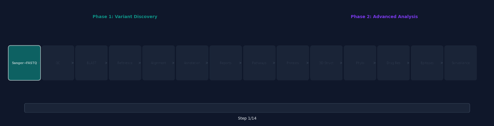
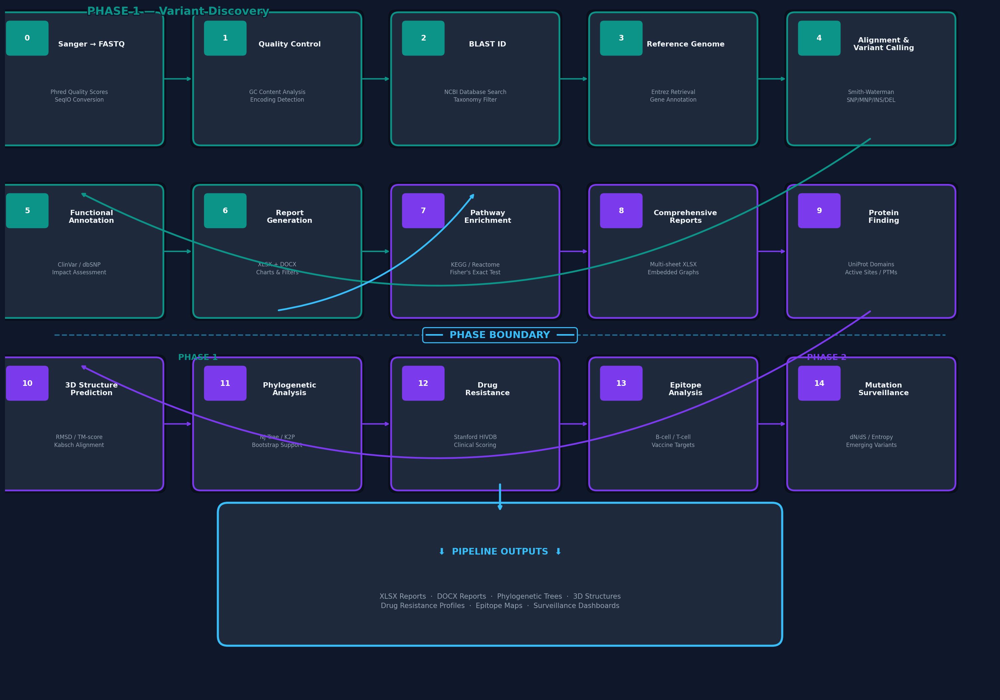
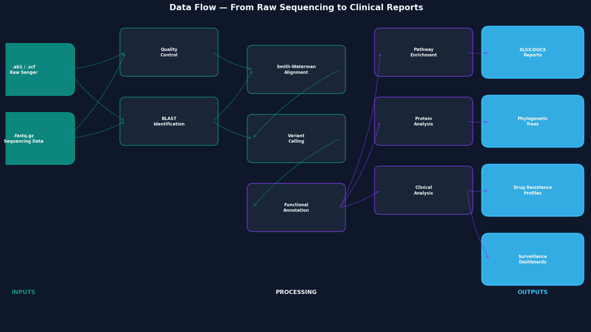
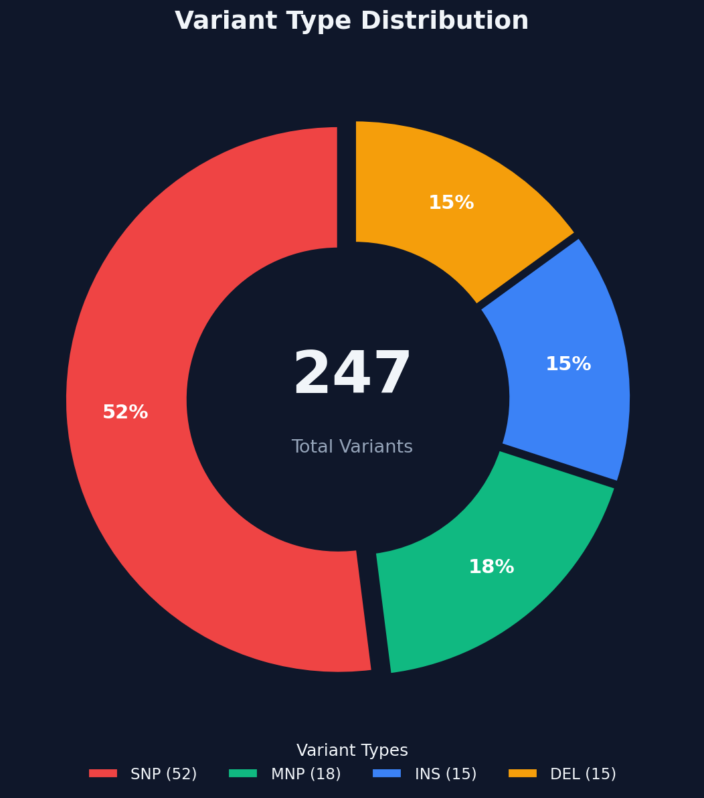
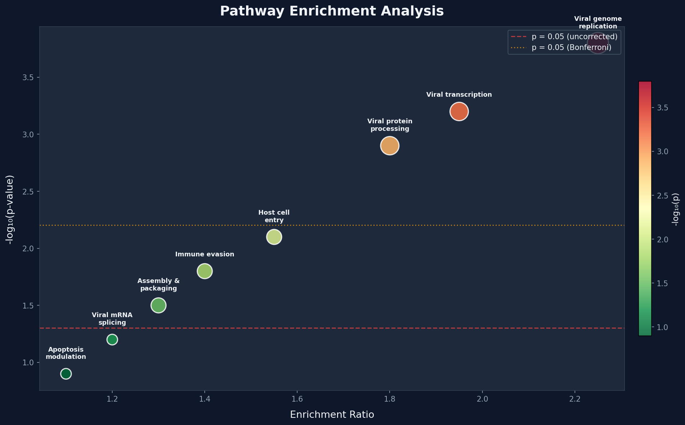
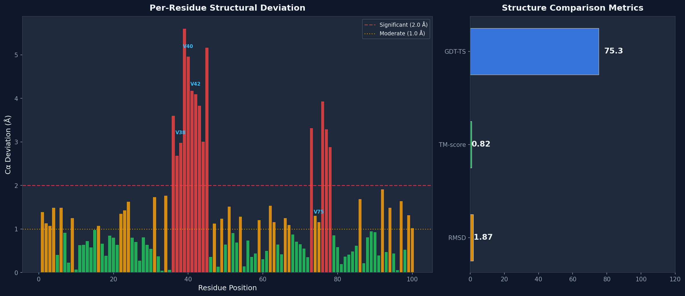
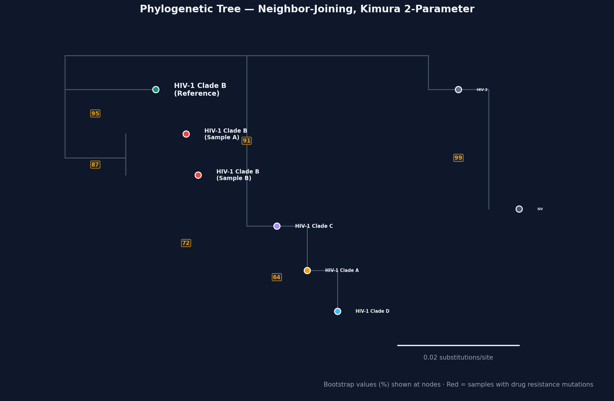
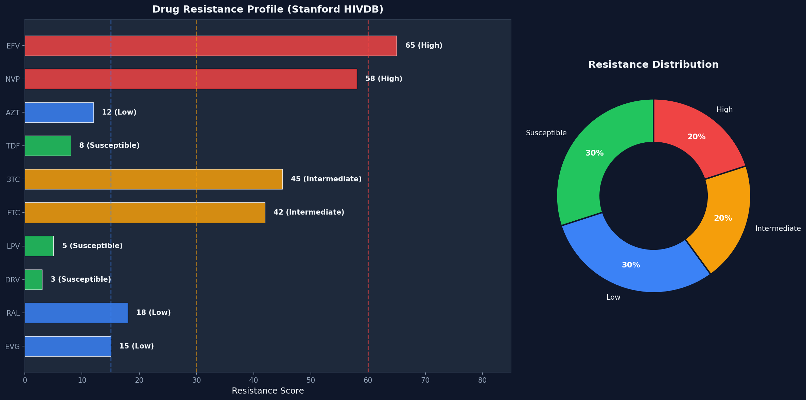
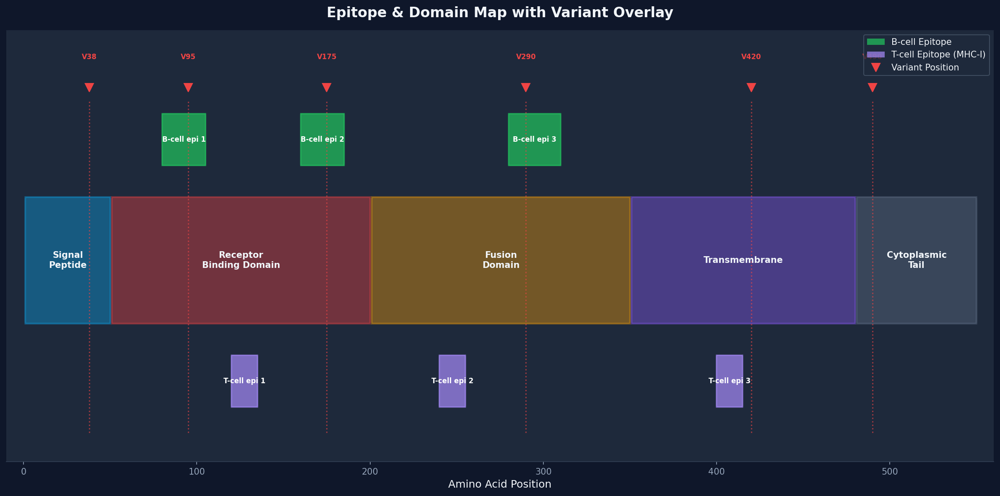
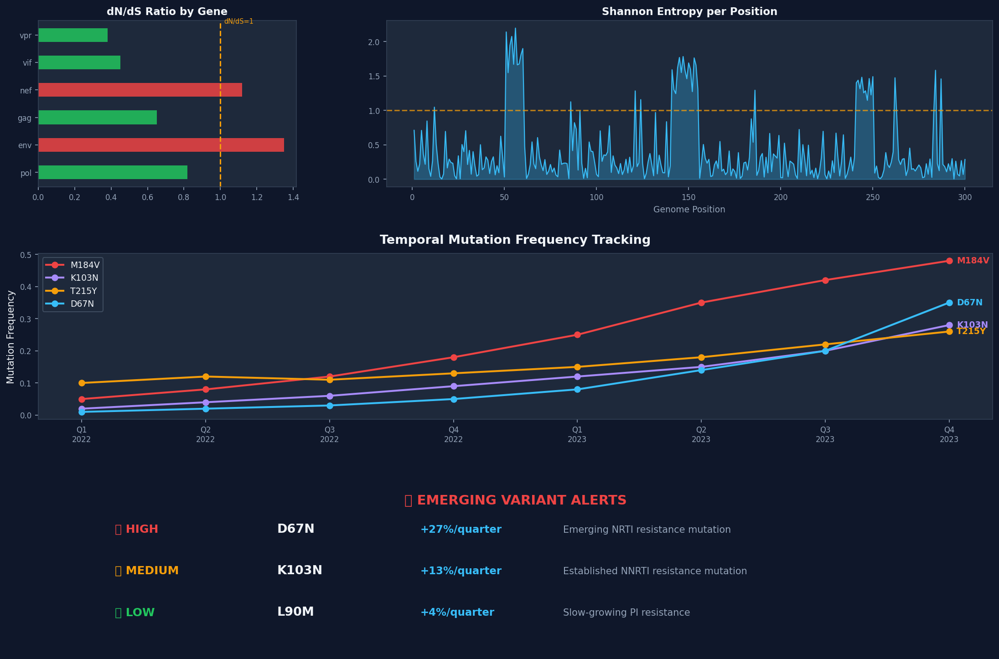

<div align="center">

# Seq2Prot

**The viral genome analyst — from raw Sanger sequencing data to clinical drug resistance reports, 3D protein structures, and mutation surveillance**

<br>

<!-- Badges styled like paper-qa / popular GitHub repos -->
<table>
  <tr>
    <td><strong>Language</strong></td>
    <td>
      
    </td>
  </tr>
  <tr>
    <td><strong>Core</strong></td>
    <td>
      
      
      
      
    </td>
  </tr>
  <tr>
    <td><strong>Visualization</strong></td>
    <td>
      
      
    </td>
  </tr>
  <tr>
    <td><strong>APIs & Data</strong></td>
    <td>
      
      
      
      
    </td>
  </tr>
  <tr>
    <td><strong>Environment</strong></td>
    <td>
      
      
    </td>
  </tr>
  <tr>
    <td><strong>Status</strong></td>
    <td>
      
      
      
    </td>
  </tr>
</table>

<br>

**14 Pipeline Steps · 2 Analysis Phases · Fully Executable · Clinical-Grade Output**

<br>

[🚀 Quick Start](#-quick-start) · [🗺 Pipeline](#-pipeline-overview) · [📊 Visualizations](#-visualizations) · [🧪 Methodology](#-methodology) · [📁 Structure](#-project-structure)

</div>

---

## 📋 Table of Contents

- [Overview](#-overview)
- [Quick Start](#-quick-start)
- [Pipeline Overview](#-pipeline-overview)
- [Visualizations](#-visualizations)
- [Methodology](#-methodology)

---

## 🔬 Overview

This pipeline performs **comprehensive viral genomic variant analysis** — tracing the cascade from a single nucleotide change through codon alteration, amino acid substitution, protein structural change, pathway disruption, and clinical outcome.

> **A single nucleotide variant has cascading effects**: it changes a codon → alters an amino acid → modifies protein structure → disrupts a biological pathway → potentially causes drug resistance or immune escape. This pipeline traces every layer of that cascade.

```
DNA Variant → Codon Change → AA Substitution → Structural Change → Pathway Impact → Clinical Outcome
     ↑              ↑               ↑                  ↑                 ↑                ↑
  Step 4         Step 5          Step 5            Step 10           Step 7          Step 12
```

### Key Capabilities

| Feature | Description |
|---------|-------------|
| **Sanger → FASTQ** | Convert proprietary sequencing formats to universal FASTQ with Phred quality scores |
| **BLAST Identification** | Automatic virus species identification against NCBI nucleotide database |
| **Smith-Waterman Alignment** | Local alignment with affine gap penalties for sensitive variant detection |
| **Variant Classification** | SNP / MNP / INS / DEL calling with allele frequency estimation |
| **Functional Annotation** | ClinVar, dbSNP, UniProt cross-referencing with impact assessment |
| **Pathway Enrichment** | KEGG + Reactome analysis with Fisher's exact test and FDR correction |
| **Protein Characterization** | UniProt domain mapping, active site identification, PTM overlap analysis |
| **3D Structure Comparison** | RMSD, TM-score, GDT-TS, per-residue deviation via Kabsch alignment |
| **Phylogenetics** | Neighbor-Joining trees with K2P distance and bootstrap confidence |
| **Drug Resistance** | Stanford HIVDB scoring system with clinical resistance level classification |
| **Epitope Analysis** | B-cell/T-cell epitope prediction with vaccine target identification |
| **Mutation Surveillance** | dN/dS ratio, Shannon entropy, temporal trend tracking, emerging variant alerts |

---

## 🚀 Quick Start

```bash
# 1. Clone the repository
git clone https://github.com/your-username/virus-genomic-analyzer.git
cd virus-genomic-analyzer

# 2. Install dependencies
pip install biopython numpy scipy matplotlib pandas openpyxl python-docx requests jupyter

# 3. Run Phase 1 — Variant Discovery (Steps 0–6)
jupyter notebook Virus_Genomic_Variant_Analysis_Beginners_Guide.ipynb

# 4. Run Phase 2 — Advanced Analysis (Steps 7–14)
jupyter notebook Virus_Genomic_Variant_Analysis_Phase2_Beginners_Guide.ipynb
```

> **Note**: All notebooks run with simulated/demo data by default. No external files or API keys required. Set `DEMO_MODE = False` to use real sequencing data.

---

## 🗺 Pipeline Overview

<div align="center">

</div>

<br>

<div align="center">

</div>

### Data Flow

```
.ab1 / .scf / .phd / .seq          Raw Sanger sequencing files
         │
    Step 0 ↓ Sanger → FASTQ conversion (BioPython SeqIO, Phred quality)
         │
      .fastq / .fastq.gz            Standard sequencing format
         │
    Step 1 ↓ Quality Control (encoding detection, GC content, filtering)
    Step 2 ↓ BLAST Identification (NCBI BLAST, virus taxonomy filter)
    Step 3 ↓ Reference Genome (NCBI Entrez, GenBank, gene annotation)
    Step 4 ↓ Alignment & Variant Calling (Smith-Waterman, SNP/MNP/INS/DEL)
    Step 5 ↓ Functional Annotation (ClinVar, dbSNP, UniProt, impact assessment)
    Step 6 ↓ Basic Reports (XLSX with charts + DOCX narrative)
         │
    ──────── Phase 1 Complete ────────
         │
    Step  7 ↓ Pathway Enrichment (KEGG, Reactome, Fisher's exact test, FDR)
    Step  8 ↓ Comprehensive Reports (multi-sheet XLSX + embedded graphs)
    Step  9 ↓ Protein Finding (UniProt domains, active sites, PTMs)
    Step 10 ↓ 3D Structure Prediction (RMSD, TM-score, per-residue deviation)
    Step 11 ↓ Phylogenetic Analysis (NJ tree, bootstrap, clade assignment)
    Step 12 ↓ Drug Resistance (Stanford HIVDB scores, clinical recommendations)
    Step 13 ↓ Epitope Analysis (B-cell/T-cell epitopes, vaccine targets)
    Step 14 ↓ Mutation Surveillance (dN/dS, Shannon entropy, emerging variants)
         │
    ──────── Phase 2 Complete ────────
         │
         ↓ Final Outputs: XLSX + DOCX + Trees + 3D Structures + Clinical Reports
```

<div align="center">

</div>

---

## 🔍 Phase 1: Variant Discovery (Steps 0–6)

### Step 0: Sanger → FASTQ Conversion

**Idea**: Raw Sanger sequencing instruments produce proprietary binary formats (`.ab1`, `.scf`). This step converts them to the universal FASTQ format, preserving Phred quality scores that quantify base-calling confidence.

```
.ab1 file (binary)  →  BioPython SeqIO  →  .fastq (text, 4 lines per read)
                         │
                    Phred quality: ASCII(char) - 33 = Q score
                    Q30 = 99.9% accuracy, Q40 = 99.99% accuracy
```

**Key parameters**: `Phred+33` encoding (Sanger/Illumina 1.8+), default quality assignment for formats without quality data.

---

### Step 1: FASTQ Quality Control

**Idea**: Before analysis, verify data quality. Wrong quality encoding (Phred+33 vs Phred+64) leads to incorrect filtering and false variant calls. Auto-detection of encoding scheme prevents systematic errors.

**Key statistics**: Mean quality per read, GC content, N content, read length distribution, quality encoding auto-detection.

---

### Step 2: Virus Identification via BLAST

**Idea**: The virus species is unknown a priori. BLAST compares sequencing reads against the entire NCBI nucleotide database to identify the species, returning taxonomy, E-value, and alignment coordinates.

**Key parameters**: E-value threshold (`0.001`), virus taxonomy filter (`txid10239`), `hit_start`/`hit_end` for genomic region identification.

---

### Step 3: Reference Genome & Gene Annotation

**Idea**: To detect variants, a reference genome is needed for comparison. NCBI Entrez retrieves the reference sequence plus gene annotations (CDS, gene name, product, protein translation) that provide the framework for functional interpretation.

---

### Step 4: Alignment & Variant Calling

**Idea**: Align each read to the reference genome using Smith-Waterman local alignment, then identify positions where the read differs from the reference. Variant calling classifies each difference by type.

**Key parameters**:

| Parameter | Default | Effect When Increased |
|-----------|---------|----------------------|
| Match score | +2 | Stricter alignment (fewer mismatches tolerated) |
| Mismatch penalty | -3 | Fewer mismatches accepted |
| Gap open penalty | -5 | Fewer gaps (prefers mismatches over indels) |
| Gap extend penalty | -2 | Shorter indels |
| Min allele frequency | 0.05 | Fewer variants (high confidence only) |

**Variant types**: SNP (single nucleotide), MNP (multiple nucleotide), INS (insertion), DEL (deletion).

<div align="center">

</div>

---

### Step 5: Functional Annotation

**Idea**: A DNA position change is meaningless without biological context. Each variant is annotated with: gene, codon change, amino acid change, clinical significance (ClinVar), population frequency (dbSNP), and protein impact (UniProt).

---

### Step 6: Report Generation

**Idea**: Generate professional reports — XLSX for data analysis (color-coded, auto-filtered, with charts) and DOCX for clinical reading (narrative format, methodology appendix).

---

## 🧬 Phase 2: Advanced Analysis (Steps 7–14)

### Step 7: Pathway Enrichment Analysis

**Idea**: Individual variants affect genes, but genes work together in biological pathways. Enrichment analysis asks: **"Are variant-affected genes concentrated in certain pathways more than expected by chance?"** This reveals functional patterns invisible at the single-gene level.

**Statistical framework**: Fisher's exact test on a 2×2 contingency table, followed by multiple testing correction (Benjamini-Hochberg FDR).

<div align="center">

</div>

**Why it matters**: Finding that 3/4 genes in the "Viral genome replication" pathway have variants (enrichment ratio 2.25×, FDR p=0.028) reveals the virus may have altered its replication strategy — something invisible when looking at individual genes.

---

### Step 8: Comprehensive Excel Reports with Graphs

**Idea**: Phase 2 reports expand beyond basic variant data. Multi-sheet XLSX workbooks include pathway enrichment sheets, protein impact sheets, and embedded charts (pie charts, bar charts, heatmaps) with color coding and auto-filters.

**Report structure**: 8 sheets (Summary, All Variants, Pathway Enrichment, Protein Impact, Pathogenic, Novel, Gene Map, Methodology).

---

### Step 9: Protein Finding & Characterization

**Idea**: DNA variants change amino acids. This step determines **WHERE** in the protein the change occurs — functional domain? Active site? Binding site? Post-translational modification site? The location determines the biological impact.

**Impact assessment**:

| Location | AA Change Type | Impact Level |
|----------|---------------|-------------|
| Active/binding site | Any | **HIGH** |
| Functional domain | Radical (e.g., R→P) | **HIGH** |
| Functional domain | Conservative (e.g., I→L) | **MODERATE** |
| Outside domain | Radical | **MODERATE** |
| Outside domain | Conservative | **LOW** |

---

### Step 10: 3D Structure Prediction & Comparison

**Idea**: Protein function depends on 3D shape. If a variant changes the shape, function may be altered. This step predicts structures for both wild-type and variant proteins, then quantifies the difference.

**Key metrics**:

| Metric | Formula | Interpretation |
|--------|---------|----------------|
| **RMSD** | √(Σ‖pᵢ − qᵢ‖² / N) | < 2Å = similar, > 4Å = different conformation |
| **TM-score** | Length-normalized similarity | > 0.5 = same fold, < 0.3 = different fold |
| **GDT-TS** | %(≤1Å) + %(≤2Å) + %(≤4Å) + %(≤8Å) | > 80 = high accuracy |
| **Per-residue deviation** | Distance at each Cα | Identifies **WHERE** the change is |

<div align="center">

</div>

---

### Step 11: Phylogenetic Analysis

**Idea**: Place the identified virus strain in its evolutionary context. Which clade does it belong to? How related is it to other strains? Are the variants shared across lineages? Phylogenetic analysis answers these questions.

**Method**: Neighbor-Joining tree with Kimura 2-parameter distance correction and bootstrap confidence assessment.

<div align="center">

</div>

---

### Step 12: Drug Resistance Analysis

**Idea**: Some variants directly confer resistance to antiviral drugs. By matching variant positions against known resistance databases (Stanford HIVDB), the pipeline predicts which drugs will be ineffective for a given viral strain.

**Scoring system** (Stanford HIVDB):

| Score | Level | Clinical Meaning |
|-------|-------|-----------------|
| 0–9 | Susceptible | Drug works normally |
| 10–14 | Potential low-level | Minor concern |
| 15–29 | Low-level | Some reduction in efficacy |
| 30–59 | Intermediate | Significant reduction |
| ≥ 60 | High-level | Drug likely ineffective |

<div align="center">

</div>

---

### Step 13: Epitope Analysis & Vaccine Targets

**Idea**: The immune system recognizes viral proteins through epitopes (short peptide regions). If a variant falls within an epitope, the virus may escape immune recognition. This step predicts epitopes and checks for variant overlap to identify vaccine targets and immune escape risks.

**Prediction methods**:
- **B-cell epitopes**: Hydrophilicity + flexibility scoring (surface-exposed regions)
- **T-cell epitopes (MHC-I)**: 9-mer peptide binding motif analysis
- **Conservation analysis**: Highly conserved epitopes make better vaccine targets

<div align="center">

</div>

---

### Step 14: Mutation Surveillance & Temporal Analysis

**Idea**: Viruses evolve in real-time. Tracking how mutation frequencies change over time detects emerging variants before they become dominant. This step provides early warning for public health response.

**Key analyses**:

| Analysis | Method | Interpretation |
|----------|--------|----------------|
| **dN/dS ratio** | Non-synonymous / Synonymous rate | < 1 = purifying selection, > 1 = positive selection |
| **Shannon entropy** | -Σ pᵢ log₂(pᵢ) per position | Higher = more diverse = more variation |
| **Growth rate** | Δ frequency / Δ time | > 10%/quarter = emerging variant |
| **Emerging variant detection** | Growth rate threshold | Alerts for mutations increasing rapidly |

<div align="center">

</div>

---

## 📊 Visualizations

<div align="center">

### Pipeline Flow Animation


### Pipeline Architecture


### Data Flow Diagram


### Variant Type Distribution


### Pathway Enrichment


### 3D Structure Deviation


### Drug Resistance Profile


### Phylogenetic Tree


### Epitope & Domain Map


### Mutation Surveillance Dashboard


</div>

---

## 🧪 Methodology

### Statistical Methods

| Method | Step | Purpose |
|--------|------|---------|
| **Phred quality scoring** | 0–1 | Base-calling confidence (Q = -10×log₁₀(P_error)) |
| **Smith-Waterman alignment** | 4 | Local sequence alignment with affine gap penalties |
| **Fisher's exact test** | 7 | Pathway enrichment significance (2×2 contingency table) |
| **Benjamini-Hochberg FDR** | 7 | Multiple testing correction for pathway analysis |
| **Bonferroni correction** | 7 | Conservative alternative for multiple testing |
| **Kabsch algorithm (SVD)** | 10 | Optimal protein structure superposition (rotation/translation) |
| **Neighbor-Joining** | 11 | Phylogenetic tree construction from distance matrix |
| **Kimura 2-parameter** | 11 | Nucleotide substitution distance (Ti/Tv correction) |
| **Bootstrap resampling** | 11 | Confidence assessment for tree topology |
| **Shannon entropy** | 14 | Per-position sequence diversity measurement |
| **dN/dS ratio** | 14 | Detection of natural selection pressure |

### Key Thresholds

| Threshold | Value | Meaning |
|-----------|-------|---------|
| Quality score (Phred) | Q30 | 99.9% base-calling accuracy |
| BLAST E-value | 0.001 | 0.1% chance of random match |
| Enrichment p-value | 0.05 (FDR) | 5% of discoveries are false positives |
| RMSD significance | 2.0 Å | Above = notable structural change |
| TM-score fold threshold | 0.5 | Above = same protein fold |
| Bootstrap confidence | 70% | Above = moderate-to-strong tree support |
| Drug resistance | Score ≥ 60 | High-level resistance |
| Emerging variant | Growth > 10%/quarter | Rapidly increasing mutation |

### External Databases & APIs

| Resource | Purpose | Access Method |
|----------|---------|---------------|
| [NCBI BLAST](https://blast.ncbi.nlm.nih.gov/) | Virus species identification | `Bio.Blast.NCBIWWW` |
| [NCBI Entrez](https://www.ncbi.nlm.nih.gov/books/NBK25501/) | Genome & annotation retrieval | `Bio.Entrez` |
| [KEGG REST API](https://www.kegg.jp/kegg/rest/keggapi.html) | Pathway database queries | HTTP REST |
| [Reactome](https://reactome.org/) | Pathway enrichment analysis | HTTP REST |
| [UniProt](https://www.uniprot.org/) | Protein annotations & domains | HTTP REST |
| [RCSB PDB](https://www.rcsb.org/) | 3D protein structures | HTTP REST |
| [Stanford HIVDB](https://hivdb.stanford.edu/) | Drug resistance mutations | Reference data |
| [IEDB](https://www.iedb.org/) | Immune epitope database | Reference data |
---

## ⚠️ Important Notes

- **NCBI API**: Requires email (`NCBI_EMAIL`) and optional API key (`NCBI_API_KEY`) for higher rate limits
- **Demo mode**: All notebooks run with simulated data by default — no external data needed
- **Rate limiting**: KEGG, Reactome, and NCBI APIs have rate limits (~1 request/second)
- **Memory**: Large datasets (>10,000 variants) may require chunked processing
- **3D structures**: Real structure prediction requires AlphaFold2 or ColabFold (GPU recommended)

---

## 📄 License

This project is licensed under the MIT License — see the [LICENSE](LICENSE) file for details.

---

<div align="center">

[⬆ Back to Top](#-virus-genomic-variant-analysis-pipeline)

</div>

